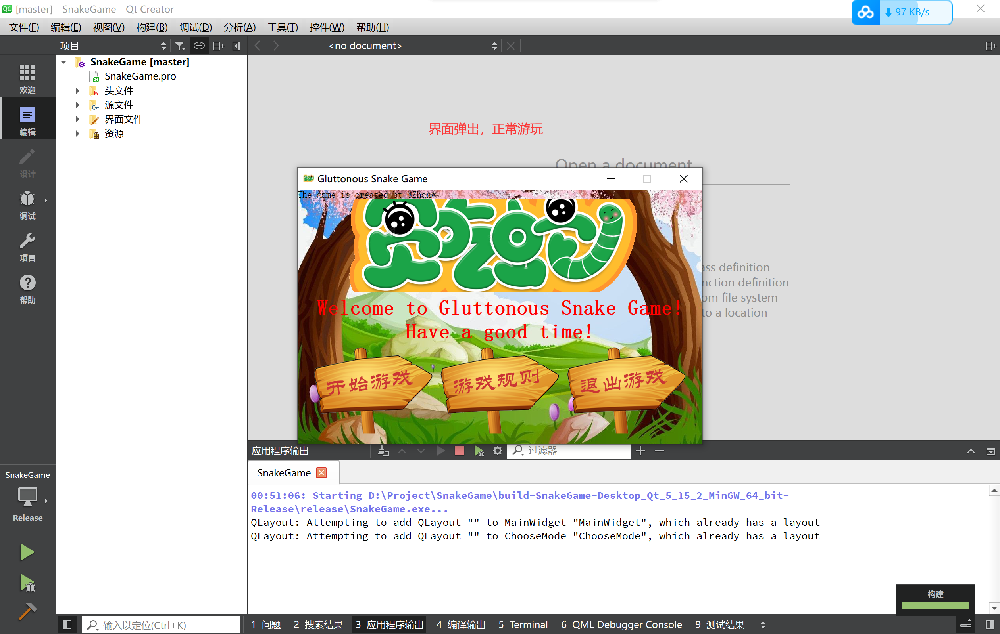

# SnakeGame
基于Qt库的C++基础贪吃蛇游戏项目

## 项目介绍
本项目是作者在大一下学期，于C++工程技能与实训时期制作的贪吃蛇小游戏，很简单的练手，适合C++新手熟悉C++各种知识点与Qt编程。

最近在整理我之前做过的项目，翻到了大一时制作的贪吃蛇小项目。忽然间回忆涌上心头：时间一晃而过，已经两年了。那会儿的我还是一个天天赶实验报告的小白……  
这个项目是在学校实训的时候，临近ddl时连熬几个大夜，匆匆制作的。还拿到了实训的“优”的评级，对于新手来说有一定的学习价值，对于大佬们来说就十分幼稚了。当时的我刚刚接触编程，对于C++和Qt还非常生疏，因此项目中有许多不符合软件开发规范的内容，还请诸位谅解。

未来如果有时间的话，我还会将这个项目进行重构优化。没有时间的话……就让它停留在这个最生涩的版本吧，毕竟这是我青春时鏖战了好几个晚上的成果，值得留恋。

## 演示效果
### 首页

### 模式选择

### 游戏规则

### 经典模式

### 双人模式

### 地狱模式


## 下载演示
- 源码下载
    1. 如您是软件开发者，想要阅读源码或对本项目进行自定义配置或修改，请选择master分支下载最新源码，请确保你拥有Qt开发环境与**Qt Creator**，或使用其他拥有Qt开发环境的编译器；
    2. 解压下载好的zip包，或直接使用**git**进行**clone**；
    3. 这里以**Qt Creator**为例，进入Qt Creator，点击左侧**打开项目**按钮，在文件资源选择器中选择`SnakeGame.pro`文件打开项目；  
   
    
    
    

    4. 待项目构建完成，控制台不输出相关错误时，点击项目左下角三角符号进行运行，或使用快捷键`Ctrl+R`，或右键项目父文件夹，在展开的选项卡中选择**运行**，即可在新增窗口中运行程序。

    

    


- 发布版体验试玩
    1. 如您是游客，仅仅想体验一下本项目，请选择发行版下载最新发布版压缩包。无需拥有Qt开发环境

    2. 下载成功后，解压压缩包，点击文件夹中的`SnakeGame.exe`文件，即可进行游戏
   
    


## 重点内容
- 按钮动画：
    - 鼠标在按钮上点击，按钮高亮，鼠标松开后，恢复正常；若正常点击按钮，按钮跳动，动画结束后，实行按钮功能

    

    - 实现过程：新建一个`MyPushButton`的类，继承`QPushButton`类。重写构造方法、鼠标点击事件、鼠标释放事件，并增添跳跃动画。
    - 代码详解：
    ```C++
    // mypushbutton.h
    #ifndef MYPUSHBUTTON_H
    #define MYPUSHBUTTON_H

    #include <QWidget>
    #include <QPushButton>
    #include <QPixmap>
    #include <QPropertyAnimation>

    class MyPushButton : public QPushButton
    {
        Q_OBJECT
    public:
        //explicit MyPushButton(QWidget *parent = nullptr);

        //press image is empty path, if it is lack of the second path, there is no press animaltion
        MyPushButton(QString normalImg, QString pressImg="");

        QString normalImg;
        QString pressImg;

        void zoomDown();
        void zoomUp();

        //press event
        void mousePressEvent(QMouseEvent* event);

        //releaes event
        void mouseReleaseEvent(QMouseEvent* event);

    signals:

    public slots:
    };

    #endif // MYPUSHBUTTON_H

    ```

    ```C++
    // mypushbutton.cpp
    #include "mypushbutton.h"

    //MyPushButton::MyPushButton(QWidget *parent) : QWidget(parent)
    //{

    //}

    MyPushButton::MyPushButton(QString normalImg, QString pressImg)
    {
        //normal image path
        this->normalImg=normalImg;

        //press image path
        this->pressImg=pressImg;

        QPixmap pix;
        //loag normalImg
        pix.load(normalImg);

        //set fixed size
        this->setFixedSize(pix.width(), pix.height());

        //set style sheet
        this->setStyleSheet("QPushButton{border:0px;}");

        //set icon
        this->setIcon(pix);

        //set icon size
        this->setIconSize(QSize(pix.width(), pix.height()));
    }

    void MyPushButton::zoomDown()
    {
        //create animation
        QPropertyAnimation* animation=new QPropertyAnimation(this, "geometry");

        //set time gap
        animation->setDuration(200);

        //start
        animation->setStartValue(QRect(this->x(), this->y(), this->width(), this->height()));
        //end
        animation->setEndValue(QRect(this->x(), this->y()+10, this->width(), this->height()));

        //set animation rules
        animation->setEasingCurve(QEasingCurve::OutBounce);

        animation->start();
    }

    void MyPushButton::zoomUp()
    {
        //create animation
        QPropertyAnimation* animation=new QPropertyAnimation(this, "geometry");

        //set time gap
        animation->setDuration(200);

        //start
        animation->setStartValue(QRect(this->x(), this->y()+10, this->width(), this->height()));
        //end
        animation->setEndValue(QRect(this->x(), this->y(), this->width(), this->height()));

        //set animation rules
        animation->setEasingCurve(QEasingCurve::OutBounce);

        animation->start();
    }

    void MyPushButton::mousePressEvent(QMouseEvent *event)
    {
        QPixmap pix;
        //load press img
        pix.load(pressImg);

        //set fixed size
        this->setFixedSize(pix.width(), pix.height());

        //set style sheet
        this->setStyleSheet("QPushButton{border:0px;}");

        //set icon
        this->setIcon(pix);

        //set icon size
        this->setIconSize(QSize(pix.width(), pix.height()));

        //let parent do other thing
        return QPushButton::mousePressEvent(event);
    }

    void MyPushButton::mouseReleaseEvent(QMouseEvent *event)
    {

        QPixmap pix;
        //load normal img
        pix.load(normalImg);

        //set fixed size
        this->setFixedSize(pix.width(), pix.height());

        //set style sheet
        this->setStyleSheet("QPushButton{border:0px;}");

        //set icon
        this->setIcon(pix);

        //set icon size
        this->setIconSize(QSize(pix.width(), pix.height()));


        //let parent do other thing
        return QPushButton::mouseReleaseEvent(event);
    }

    ```

- 蛇身绘制
    - 不同于互联网上普通的贪吃蛇教程，蛇身是由简单的小方块构成的。我的小蛇由三个部分组成：蛇头、蛇身、蛇尾，都有着不同运动方向的不同贴图。  

    

    - 创建`MySnake`类，继承`Qwidget`类，重写绘图事件，分别绘制头、身、尾。根据`MySnake`类中`moveFlag`成员变量判断蛇头方向、`MySnake`中`judgeSnakeTailDirection`成员函数判断蛇尾方向

    

    - 代码详解：
    ```C++
    // mysnake.h
    #ifndef MYSNAKE_H
    #define MYSNAKE_H

    #include <QWidget>
    #include <QList>
    #include <QRectF>
    #include <QPoint>
    #include <QPainter>
    #include <QPen>
    #include <QtDebug>

    enum Direction
    {
        Dir_Up,
        Dir_Down,
        Dir_Left,
        Dir_Right
    };

    class MySnake : public QWidget
    {
        Q_OBJECT
    public:
    //    explicit MySnake(QWidget *parent = nullptr);

        MySnake(bool secondSnake=false, bool hellSnake=false);

        bool secondSnake;
        bool hellSnake;//creat the wall

        QList <QRectF> snake;
        QList <QRectF> snake2;
        QList <QRectF> snake3;
        int node=20;

        int moveFlag=Dir_Up;
        int moveFlag2=Dir_Up;
        bool gameStart=false;
        bool gameOver=false;

        //move
        void addUp();
        void addDown();
        void addLeft();
        void addRight();

        void deleteList();

        void addUp2();
        void addDown2();
        void addLeft2();
        void addRight2();

        void deleteList2();

        //judge snake tail direction
        int judgeSnakeTailDirection();
        int judgeSnakeTailDirection2();

        //judge snake bite something
        bool judgeSnakeBite(QRectF rec);
        bool judgeSnakeBite2(QRectF rec);

        //judge snake bite itself
        bool judgeSnakeBiteItself();
        bool judgeSnakeBiteItself2();

        //judge snake bite another snake
        bool judgeSnakeBiteAnother();
        bool judgeSnakeBiteAnother2();
        bool judgeSnakeBiteWall();

        //paint event
        void paintEvent(QPaintEvent* event);

    signals:

    public slots:
    };

    #endif // MYSNAKE_H

    ```
    
    ```C++
    // mysnake.cpp
    // 代码过多，放在文章里太过繁冗，且观感十分不友好。请下载源码后进行详细查看
    ```

- 双人模式
    - 由前段时间另一款小游戏产生的灵感，两位玩家分别控制一条小蛇进行吃苹果，当咬到自己、吃到毒苹果、撞到对手的蛇身/蛇尾上则死亡，最后较长者胜利

    
    
    - 在`MySnake`类，加入一成员变量`bool secondSnake`，用于判断当前页面是否为多人模式页面。若为`true`，则构建`snake2`，并进行绘图事件的重写。在`MultiMode`类中重写键盘事件，加入小方向键更改`snake2`的运动方向。在`timeOutFun()`中对蛇的运动状态进行更新，即可实现多人模式的编写

    - 代码详解：由于该功能实现的过于复杂，在整个项目多处均进行了增加代码段，因此无法在这里简单演示。请下载**项目源码**后参考整个项目进行理解。在涉及双人模式代码段均有相关注释辅助理解

## 项目结构
由于作者当时未有清晰的项目架构设计思想，因此项目目录结构十分混乱。还望海涵，这里给出Qt Creator中的项目组织结构供大家参考。


## 更新摘要
###### v1.0.0
    1. 项目功能基本实现